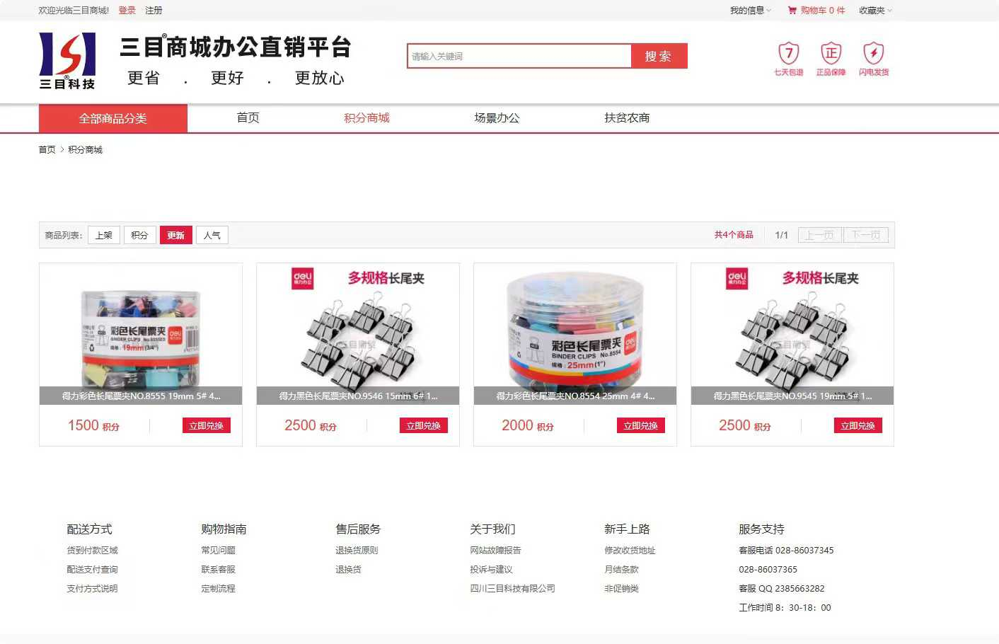
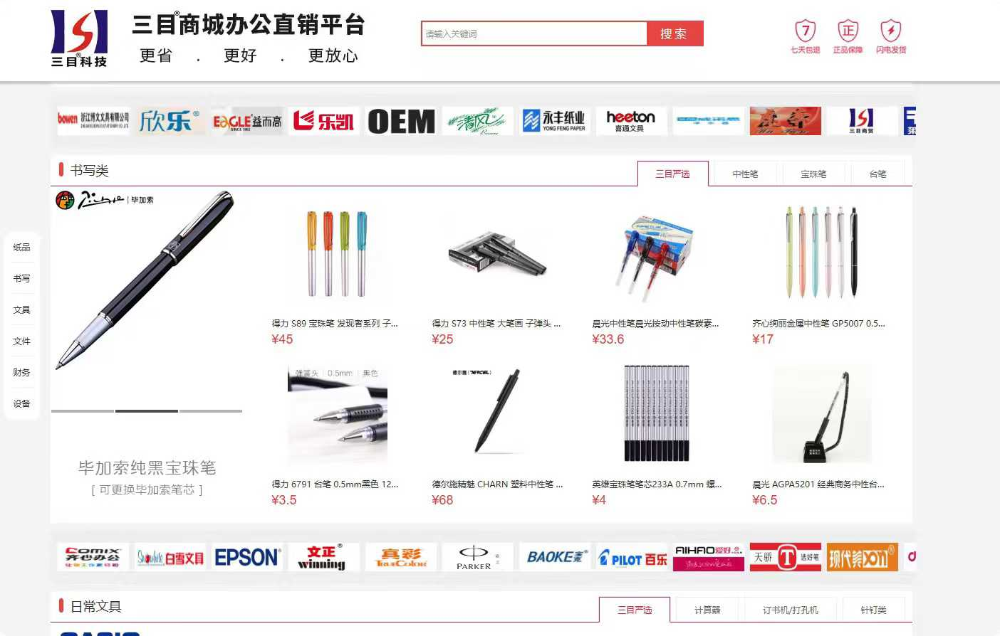
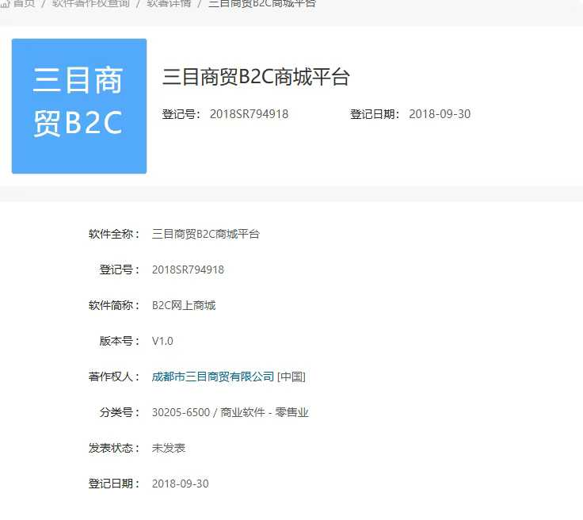
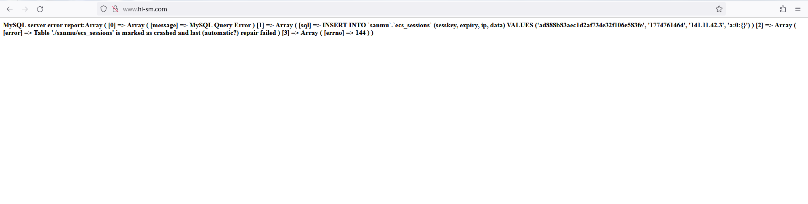

# Sanmu Commerce B2C E-commerce Platform (hi-sm.com)

**Status:** This repository is a legacy project archive. The live website (**www.hi-sm.com**) is currently offline due to database corruption. This project is showcased for portfolio purposes, demonstrating full-stack development capabilities and architectural design.

## 📌 Project Overview

This is the source code for the official B2C e-commerce platform developed for **Chengdu Sanmu Commerce & Trade Co., Ltd.** (三目微商城). As the sole Full-Stack Developer, I was responsible for the end-to-end development, architecture, deployment, and daily maintenance of this platform between approximately 2017-2018.

## 🔗 The Domain: hi-sm.com

The domain name **www.hi-sm.com** was proposed by me, reflecting a user-friendly and international-oriented brand identity:

- **"hi"**: Represents an open, friendly greeting to customers.
- **"sm"**: Stands for the company initials, Sanmu (三目).

## 💡 Technical Accomplishments & Features

This platform was built with a custom architecture (referencing Laravel principles seen in the file structure) to handle real-world commercial traffic. Key full-stack features included:

- **Front-End (UI/UX):** Custom-designed templates for dynamic product listing, user accounts, and a multi-tiered points/reward shop system.
- **Back-End (API & Logic):** Robust user authentication, shopping cart management, payment gateway integration, and order processing logic.

**Archived UI Screenshots:**

*(Product category page and main UI)*

*(Points Shop and product details UI)*

## 🏆 Intellectual Property

This platform successfully obtained the national computer software copyright registration (Registration No.: **2018SR794918**) in 2018. The official certificate is attached below:

## ⚠️ Legacy Status Notes

- **Database Missing:** The original MySQL database dump is unavailable.
- **Offline Error:** Due to historical high concurrency and subsequent server changes without maintenance, the database (`ecs_sessions` table) is corrupted, causing the live site crash error shown below:

- **Primary Purpose:** This archive focuses on showcasing the clean code structure, business logic implementation, and frontend design patterns of a fully developed commercial platform.

## 🏆 Intellectual Property

This platform successfully obtained the national computer software copyright registration (Registration No.: **2018SR794918**) in 2018. The official certificate can be viewed in this repository as `18.jpg`.

## ⚠️ Legacy Status Notes

- **Database Missing:** The original MySQL database dump is unavailable.
- **Offline Error:** Due to historical high concurrency and subsequent server changes without maintenance, the database (`ecs_sessions` table) is corrupted, causing the live site crash error shown in `3.png`.
- **Primary Purpose:** This archive focuses on showcasing the clean code structure, business logic implementation, and frontend design patterns of a fully developed commercial platform.

---
*Developed with dedication by Hao Zhou.*
